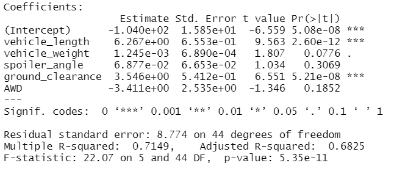
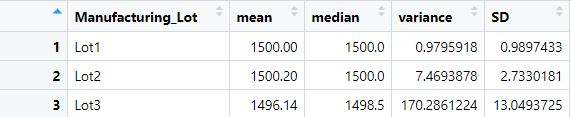
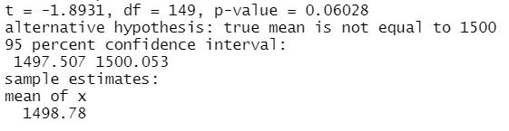
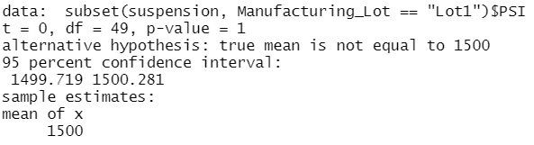
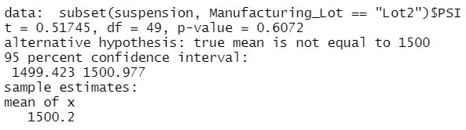
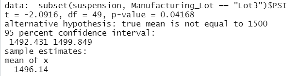

# MechaCar_Statistical_Analysis

For this project, I performed a statistical analysis of production data for MechaCar vehicles. The first section presents a multiple linear regression to predict fuel efficiency of MechaCar prototypes. The second and third sections analyze suspension coil metrics to determine if the consistency of different manufacturing lots. Finally, I propose a statistical study that could be used to compare the performance of MechaCar vehicles against vehicles from other competitors.

## Linear Regression to Predict MPG

A multiple linear regression to determine the impact of a range of metrics on the miles per gallon of MechaCar prototypes produced the following results:

- The factors that contribute the most non-random variance to MPG are vehicle length and ground clearance.
- The model produces an R-squared value of 0.71. The p-value of the linear regression is 5.35 x 10-11, which is much smaller than the significance level of 0.05%. This is sufficient to reject the null hypothesis that the slope of the linear model is zero.
- The resulting R-squared value means that the linear can predict the MPG of MechaCar prototypes with 71% effectiveness. This is better than random chance, but it is clear that there are still significant factors that are not accounted for in this model.

## Summary Statistics on Suspension Coils

MechaCar design specifications require that the variance of suspension coils not exceed 100 pounds per square inch. Current production data shows that MechaCar manufacturing lots as a whole have met this standard.

Further analysis, however, shows that not all manufacturing lots have met this requirement. Lots 1 and 2 have achieved very consistent results, but Lot 3 is well over the limit, with a variance of 170 PSI.

## T-Tests on Suspension Coils

I conducted further analysis of suspension coil data by using T-tests to determine whether the results of all manufacturing lots and each lot individually are statistically different from a population mean of 1500. 

- A T-test of all manufacturing lots resulted in a p-value of 0.06, above the significance level of 0.05. This indicates that the mean from all manufacturing lots is statistically similar to the population mean.

- T-tests of Lots 1 and 2 both return similar results. The result for Lot 1 is a p-value of 1.0. The p-value for Lot 2 is 0.6, both well above the assumed significance level. The mean PSI of coils produced at these lots is statistically very similar to the population mean. The T-tests results for Lots 1 and 2 respectively are included below:

- A T-Test of Lot 3, however, results in a P-value of 0.04. This falls below the significance level and shows that production results from Lot 3 are not consistent with desired outcomes.\

## Study Design: MechaCar vs. Competition

To compare the fuel economy of MechaCar vehicles against competitor vehicles, I would use an ANOVA test.

- The metrics to be tested would be city and highway fuel efficiency. Two ANOVA tests would be required--one for each metric. Vehicle Manufacturer would be the independent variable in the tests.
- The null hypothesis is that there is not a meaningful difference in fuel efficiency in cars produced by different manufacturers
- I selected an ANOVA test for this study because it allows testing a single dependent variable across an independent variable with multiple groups--in this case, fuel efficiency of vehicles based on manufactuer.
- The data required would be the fuel efficiency of different vehicles by manufacturer. 

